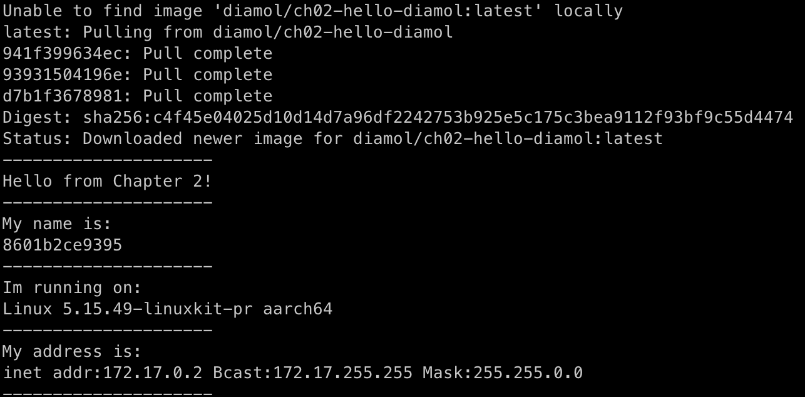
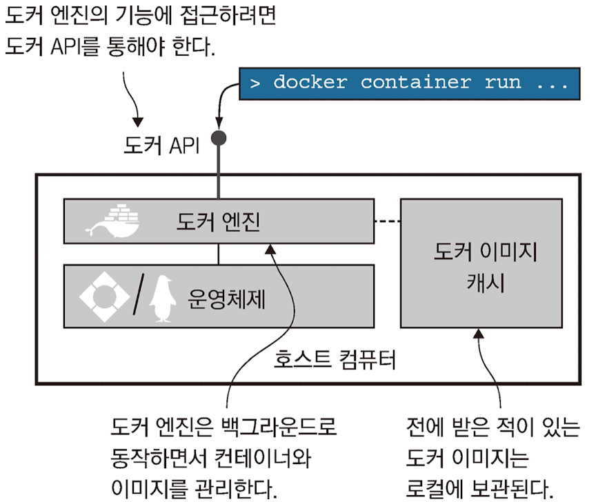

# 도커의 기본적인 사용 방법

## 최 혁

---

# 컨테이너로 Hello World 실행하기

    docker container run diamol/ch02-hello-diamol



---

# 컨테이너로 Hello World 실행하기

**도커를 사용하는 워크플로의 핵심: 빌드, 공유, 실행**

1. 애플리케이션을 컨테이너에서 실행할 수 있도록 패키징
2. 다른 사람이 패키지를 사용할 수 있도록 공유
3. 패키지를 내려받은 사람이 컨테이너를 통해 애플리케이션을 실행

---

# 컨테이너란 무엇인가?

- 도커 컨테이너는 말 그대로 물건을 담는 컨테이너이다.
- 호스트명, IP 주소, 파일 시스템은 모두 도커가 만들어낸 가상 리소스이다.
- 컨테이너는 도커가 관리하는 독립적인 가상 리소스를 갖는다.
- 도커가 관리하는 컨테이너는 서로 독립적인 환경을 갖지만 컨테이너가 실행되는 컴퓨터의 CPU와 메모리, 운영체제를 공유한다.

---

# 격리, 밀집

- 격리는 애플리케이션의 격리이다.
- 밀집이란 컴퓨터에 CPU와 메모리가 허용하는 한 되도록 많은 수의 애플리케이션을 실행
- 격리랑 밀집이라는 모순돼 보이는 조건을 달성하면 애플리케이션을 효율적으로 운용할 수 있다.
- 서로 다른 애플리케이션을 동시에 실행하는건 어렵다.
  - 자바나 닷넷 등 필요로 하는 런타임의 버전이 다를 수 있다.
  - 서로 호횐되지 않는 버전의 라이브러리 사용
  - 한 애플리케이션의 리소스 과다 점유

---

# 격리, 밀집 해결하기

- 가상머신을 이용하면 격리는 달성할 수 있지만, 각 가상 머신별 운영체제가 있기에 리소스 소모가 크고 운영이 힘들기에 격리는 달성해도 밀집은 달성할 수 없다.
- 컨테이너를 이용하면 해결할 수 있다.
  - 각각의 컨테이너는 호스트 컴퓨터의 운영체제를 공유하므로 필요한 리소스가 크게 경감
  - 실행이 빠르고 가상머신에 비해 많은 애플리케이션 실행 가능
  - 외부와 독립된 환경 제공

---

# 컨테이너를 원격 컴퓨터처럼 사용하기

```shell
# 해당 이미지로 대화식 컨테이너 실행
docker container run --interactive --tty diamol/base
# 컨테이너 호스트 이름은 컨테이너 ID와 동일
# 도커는 컨테이너를 실행할 떄마다 무작위 ID 값을 부여
hostname
# 대상 컨테이너에서 실행중인 프로세스 목록
docker container top <컨테이너ID>
# 대상 컨테이너에서 수집된 모든 로그 출력
docker container logs <컨테이너ID>
# 대상 컨테이너의 상세한 정보 출력
docker container inspect <컨테이너ID>
```

---

# 컨테이너를 사용해 웹 사이트 호스팅하기

- 컨테이너 내부의 애플리케이션이 실행 주잉어야 컨테이너의 상태도 실행중이 된다.
- 컨테이너가 종료돼도 컨테이너는 사리지지 않는다.

```shell
# 웹 사이트 호스팅
# publish 플래그를 통해 컨테이너의 포트를 호스트 컴퓨터에 공개하는데 그 원리는 복잡히다.
# 도커를 설치하면 호스트 컴퓨터의 네트워크 계층에 끼어들기에 네트워크 트래픽을
# 도커가 모두 가로채서 필요한 것을 컨테이너에 전달한다.
docker container run --detach --publish 8080:80 diamol/ch02-hello-diamol-web
```

- 각 컨테이너는 고유 IP를 갖지만 도커가 관리하는 내부 가상 네트워크 주소이지 호스트 컴퓨터가 연결된 물리 네트워크에 연결된 것은 아니다.
- $() 문법은 괄호 안의 명령의 출력을 다른 명령으로 전달하는 역할을 한다.

---

# 도커가 컨테이너를 실행하는 원리

### 도커 엔진

- 도커가 관리하는 기능을 맡은 컴포넌트
- 도커 API를 통해 맡은 기능을 수행
- 로컬 이미지 캐시를 담당하므로 새로운 이미지가 필요하면 내려받고, 기존 이미지가 있으면 사용
- 호스트 운영체제와 함께 컨테이너와 가상 네트워크 등 도커 리소스를 만드는 일도 담당
- 항시 동작하는 백그라운드 프로세스

### 도커 API

- 표준 HTTP 기반 REST API
- 도커 엔진의 설정을 통해 이 API를 네트워크를 경유해 외부 컴퓨터로부터 접근을 제어할 수 있다

---

### 도커 명령행 인터페이스(도커 CLI)

- 도커 API의 클라이언트로 우리가 docker 명령어를 사용할 때 실제 도커 API를 호출
- 빌드 환경, 운영 환경, 테스트 환경 등 서로 다른 환경에서 동작하는 컨테이너를 관리하기 위해 COI가 요청을 전달하는 곳(호스트)를 변경할 수 있다.
- 도커 API는 명세가 공개되어 있기에 도커 CPI 외의 다른 클라이언트를 사용할 수 있다.

### 그 외

- 도커 엔진은 containerd라는 컴포넌트를 통해 컨테이너를 실제로 관리함
- containerd는 호스트 운영체제가 제공하는 기능을 통해 컨테이너, 즉 가상환경을 만든다.

---



---

## 명령어 정리

docker container top <컨테이너ID>: 대상 컨테이너에서 실행중인 프로세스 목록
docker container logs <컨테이너ID>: 대상 컨테이너에서 수집된 모든 로그 출력
docker container inspect <컨테이너ID>: 대상 컨테이너의 상세한 정보 출력
docker container stats <컨테이너ID>: 실행중인 컨테이너의 상태 확인

## 플래그 정리

--interactive: 컨테이너에 접속된 상태가 된다.
--tty: 터미널 세션을 통해 컨테이너를 조작하겠다는 의미이다.
--detach: 컨테이너를 백그라운드에서 실행하며 컨테이너 ID를 출력한다.
--publish: 컨테이너의 포트를 호스트 컴퓨터에 공개한다.
