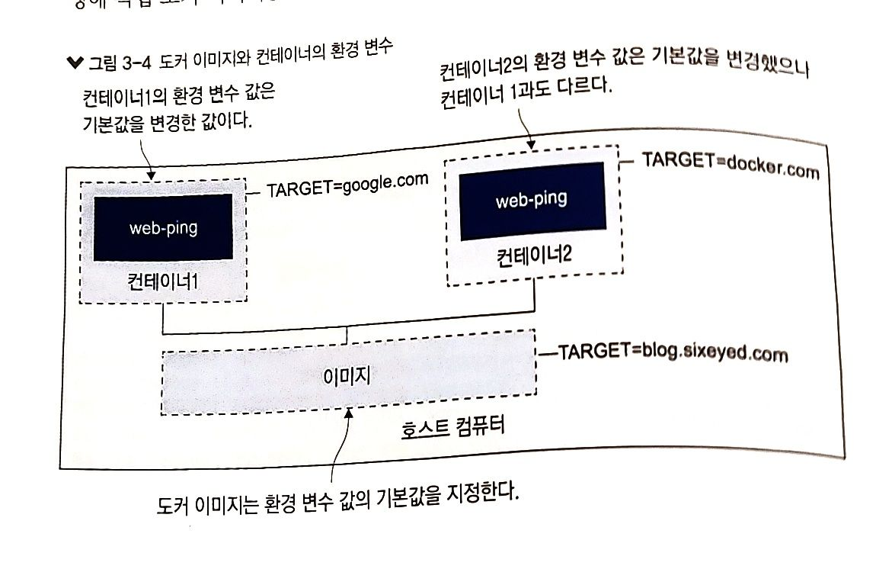
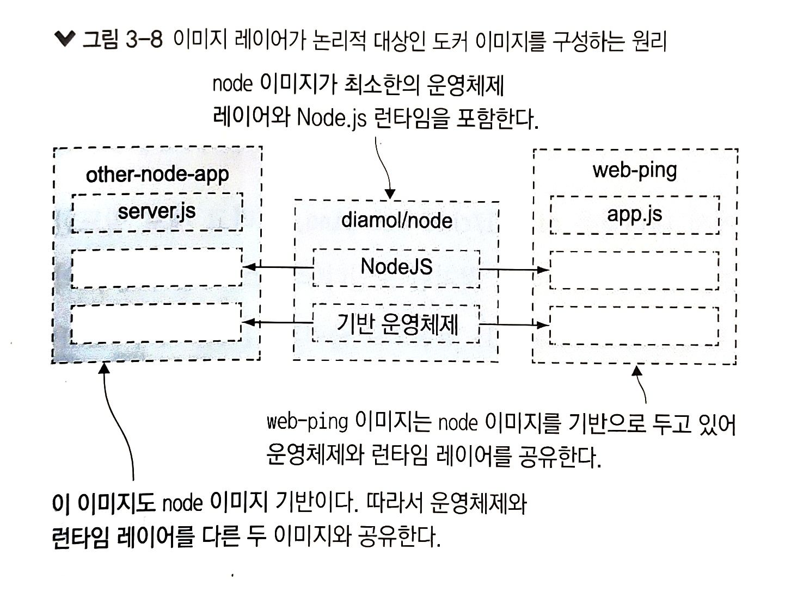

# 3.1 도커 허브에 공유된 이미지 사용하기

- 레지스트리(registry): 이미지를 제공하는 저장소
    - 도커 허브 : 무료 공개 레지스트리
- 도커 이미지는 논리적으로 하나의 대상(어플리케이션 스택 전체가 하나의 압축 파일 느낌)
    - Node.js 런타임에서 동작하는 어플리케이션은 이 역시 이미지에 포함
    - 이미지는 일반적으로 단일 파일이 아니며 이 각각의 파일들을 이미지 레이어라 함
- `docker container run -d` 에서 `-d` 는 detach. 백그라운드에서 동작한다는 의미
    - 출력 내용이 콘솔에 나타나지 않는다.
- `—name` 키워드를 통해 컨테이너에 구별하기 쉬운 이름을 붙여줄 수 있음
- 도커 컨테이너의 환경 변수
    - 키-값(key-value) 쌍
    - 아주 적은 양의 데이터만 저장 가능
    - 호스트 운영체제의 것을 가져오는 것이 아님
        - 컨테이너 호스트명, IP 주소 처럼 도커가 부여
    - 환경 변수 값은 변경 가능 e.g `docker container run —env TARGET=google.com {{image_name}}`
- **도커 이미지는 설정값의 기본을 포함해 패키징되지만, 컨테이너를 실행할 때 이 설정값을 바꿀 수 있어야 한다.**



Q1. 호스트 컴퓨터의 환경 변수는 컨테이너에서 동일하게 참조할 수 있다 O/X

# 3.2 Dockerfile 작성하기

- Dockerfile은 어플리케이션을 패키징 하기 위한 간단한 스크립트
    - 일련의 인스트럭션, 이걸 실행하면 그게 바로 도커 이미지가 됨
- web-ping 어플리케이션의 Dockerfile

    ```docker
    FROM diamol/node
    
    ENV TARGET="blog.sixeyed.com"
    ENV METHOD="HEAD"
    ENV INTERVAL="3000"
    
    WORKDIR /web-ping
    COPY app.js .
    
    CMD ["node", "/web-ping/app.js"]
    ```

    - FROM : 이미지의 시작 지점. 모든 이미지는 다른 이미지로부터 출발한다.
        - diamol/node 이미지에는 web-ping 어플리케이션을 실행하는데 필요한 런타임 Node.js가 설치되어 있다.
    - ENV: 환경 변수 값을 지정하기 위한 인스트럭션. [key]=”[value]” 형식을 따른다.
    - WORKDIR: 컨테이너 이미지 파일 시스템에 디렉터리를 만들고, 해당 디렉터리를 작업 디렉터리로 지정하는 인스트럭션
    - COPY: 로컬파일 시스템의 파일 혹은 디렉터리를 컨테이너 이미지로 복사하는 인스트럭션
    - CMD: 도커가 이미지로부터 컨테이너를 실행했을 때 실행할 명령을 지정하는 인스트럭션

Q2. 어플리케이션을 패키징하기 위해 간단한 스크립트 형태로 만들어진 파일을 [ ] 라고 한다.

# 3.3 컨테이너 이미지 빌드하기

- 이미지 빌드를 위해 Dockerfile 스크립트 이외에 이미지 이름, 패키징 파일 경로를 추가로 지정해 주어야 한다.
    - docker image build —tag web-ping .
    - —tag의 인자값이 이미지의 이름
    - 마지막 . 은 현재 작업 디렉터리
- 이렇게 이미지 빌드를 성공하면 docker image ls 로 이미지를 확인할 수 있다.
- 이렇게 빌드된 이미지는 도커 허브 이미지와 똑같이 사용할 수 있다.

# 3.4 도커 이미지와 이미지 레이어 이해하기

- 이미지가 어떻게 빌드 되어왔는지 알고 싶다면 docker image history {{image_name}} 을 통해 할 수 있다.
- 도커 이미지는 이미지 레이어가 모인 논리적 대상
    - 레이어는 도커 엔진 캐시에 물리적으로 저장된 파일
    - 이미지 레이어는 여러 이미지와 컨테이너에서 공유된다.
    - 
- docker image ls 에서 나오는 사이즈는 논리적 용량이지, 해당 디스크가 실제로 차지하는 디스크 용량을 나타내는 것은 아니다.
    - 이미지 저장에 실제 사용된 용량은 system df 명령으로 확인할 수 있다.
    - 다른 이미지와 레이어를 공유하면 논리적 용량을 합친 것보다 더 적은 용량을 디스크에서 차지한다.
- 이미지 레이어를 여러 이미지가 공유한다면, 공유되는 레이어는 수정할 수 없어야 한다.
    - 만약 이미지 레이어를 수정할 수 있다면 그 수정이 레이어를 공유하는 다른 이미지에도 영향을 미치게 된다.
    - 도커는 이미지 레이어를 읽기 전용으로 만들어 두어 이런 문제를 방지한다.

Q3. docker image ls에 나오는 이미지 사이즈는 해당 이미지가 실제로 차지하는 디스크 용량을 나타낸다. O/X

# 3.5 이미지 레이어 캐시를 이용한 Dockerfile 스크립트 최적화

- Dockerfile 스크립트의 인스트럭션은 각각 하나의 이미지 레이어와 1:1로 연결된다.
    - 그러나 인스트럭션의 결과가 이전 빌드와 같다면, 이전에 캐시된 레이어를 재사용한다.
    - 도커는 캐시에 일치하는 레이어가 있는지 확인하기 위해 해시값을 사용한다.
- 한 번 인스트럭션이 실행되면 그 다음에 오는 인스트럭션은 수정된 것이 없더라도 모두 실행된다.
    - Dockerfile 스크립트의 인스트럭션은 잘 수정하지 않는 인스트럭션이 앞으로 오고 자주 수정되는 인스트럭션이 뒤에 오도록 배치돼야 한다.
    - 이렇게 해야 캐시에 저장된 이미지 레이어를 되도록 많이 재사용할 수 있다.

Q4. Dockerfile의 인스트럭션은 자주 수정되는 인스트럭션이 앞에 오고 잘 수정되지 않는 인스트럭션이 뒤에 가도록 해야 한다. O/X

A1. X (호스트 컴퓨터에도 환경 변수가 있지만, 컨테이너와는 별개다. 컨테이너는 도커가 부여한 환경 변수만을 갖는다. p70)

A2. Dockerfile

A3. X (이미지 목록의 SIZE 항목에 나오는 수치는 이미지의 논리적 용량이지, 해당 이미지가 실제로 차지하는 디스크 용량을 나타내는 것은 아니다, p78)

A4. X (Dockerfile 스크립트의 인스트럭션은 잘 수정하지 않는 인스트럭션이 앞으로 오고 자주 수정되는 인스트럭션이 뒤에 오도록 배치돼야 한다. p80)
