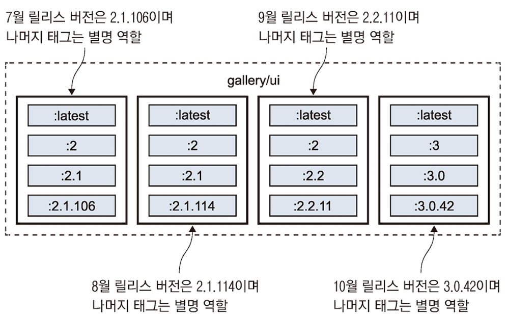

# 도커 허브 등 레지스트리에 이미지 공유하기

## 최 혁

---

# 레지스트리, 리포지토리, 이미지 태그 다루기

- 도커 허브는 도커 엔진에 기본으로 설정된 레지스트리이다.

### 이미지 레지스트리 구성요소

    docker.io[레지스트리 도메인]/diamol[개인 or 단체 계정 이름]/golang:latest[리포지토리:태그]

- 레지스트리 기본값: 도커 허브
- 태그 기본값: latest
- 레지스트리에 이미지를 푸시할 때는 항상 명시적으로 태그를 부여해야 한다.

---

# 도커 허브에 직접 빌드한 이미지 푸시하기

1. 도커 허브 계정 이름을 환경변수로 정의

```shell
export dockerId="도커허브계정이름"
```

2. 도커 허브에 로그인

```shell
docker login --username $dockerId
```

3. 기존 이미지에 새로운 이미지 참조 부여

```shell
docker image tag image-gallery $dockerId/image-gallery:v1
```

4. 이미지 푸시

```shell
docker image push $dockerId/image-gallery:v1
```

---

# 나만의 도커 레지스트리 운영하기

- 코어 레지스트리 서버는 도커 허브와 동일한 레이어 캐시 시스템을 통해 이미지를 내려받고 푸시하는 기본적인 기능을 제공한다.
- 도커 코어 레지스트리 서버는 깃허브 저장소 docker/distribution에서 개발된다.

---

# 이미지 태그 효율적으로 사용하기

- 도커 이미지 태그는 어떤 문자열이라도 포함시킬 수 있다.
- 태그는 기본적으로 [major].[minor].[patch] 형태를 따르는게 좋다.
- 도커 태그를 어디까지 지정하는지에 따라 패치 업데이트를 자동으로 전달받고 싶은지 결정할 수 있다.
  - :2로 태그를 달면 마이너 업데이트까지 자동으로 전달받는다.(예기치 못한 기능 변경을 겪을 수 있다.)
  - :2.1 태그를 달면 패치 업데이트를 자동을 전달받는다.
  - :2.1.106 태그를 달면 항상 같은 버전을 보장받을 수 있다.(보안 패치를 받을 수 없다.)

---



---

# 공식 이미지에서 골든 이미지로 전환하기

- 도커 허브는 verified publisher와 official image 제도를 통해 멀웨어 방지 가능
- 신뢰할 수 있는 큰 기업은 verified publisher로 지정하여 승인 절차를 거쳐 공개된다.
- official image는 오픈소스 소프트웨어로, 해당 프로젝트 개발 팀과 도커가 함께 관리한다.

---

# 골든 이미지

- 공식 이미지를 기반 이미지를 삼아 인증서나 환경 설정 값 등 자신이 필요한 설정을 추가한 것
- 도커 허브의 기업 리포지터리나 자체 리포지터리에서 관리된다.
