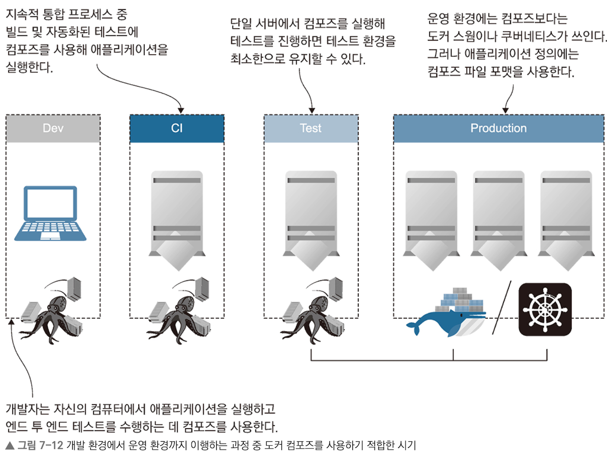

# 도커 컴포즈 파일의 구조

## 최 혁

---

# 도커 컴포즈 파일의 구조

- `도커 컴포즈 파일`은 모든 컴포넌트가 실행 중일 때 어떤 상태여야 하는지를 기술하는 파일
- 도커 컴포즈는 JSON으로 변환하기 쉬운 YAML 문법으로 기술됨
- 도커 컴포즈 파일은 다음 세 개의 statement로 구성됨
  - version: 이 파일에 사용된 도커 컴포즈 파일 형식의 버전
  - services: 애플리케이션을 구성하는 모든 컴포넌트 (하나의 서비스에 같은 이미지로 여러 컨테이너를 띄울 수 있기에 컨테이너가 아닌 서비스 개념을 단위로 삼는다)
  - networks: 서비스 컨테이너가 연결된 모든 도커 네트워크

---

# 도커 컴포즈 파일의 구조

```yaml
version: "3.7"

services:
  todo-web:
    image: diamol/ch06-todo-list
    ports:
      - "8020:80"
    networks:
      - app-net

networks:
  app-net:
    external: # external은 nat 네트워크가 이미 존재하므로 새로 생성하지 말라는 뜻
      name: nat
```

위 도커 컴포즈 파일 실행 결과는 다음 명령어와 같다.

docker container run -p 8020:80 --name todo-web --network nat diamol/ch06-todo-list

---

# 도커 컴포즈로 여러 컨테이너로 구성된 애플리케이션 실행하기

```yaml
accesslog:
  image: diamol/ch04-access-log

iotd:
  image: diamol/ch04-image-of-the-day
  ports:
    - "80"

image-gallery:
  image: diamol/ch04-image-gallery
  ports:
    - "8010:80"
  depends_on:
    - accesslog
    - iotd
  # depends_on: accesslog, iotd 서비스가 실행된 이후 image-gallery가 실행됨
```

위 구성설정으로 docker-compose를 실행하면 3개의 컨테이너가 실행된다.

---

# 도커 컴포즈를 활용한 스케일 업

```shell
# 백그라운드로 실행
docker-compose up --detach

# iotd API 서버를 3개로 띄움
docker-compose up -d --scale iotd=3

# --tail=1은 각 iotd 컨테이너의 마지막 로그를 출력하라는 의미
docker-compose logs --tail=1 iotd
```

---

# 도커 컴포즈 특징

- 도커 컴포즈는 컨테이너를 관리하는 별도의 명령이지만 내부적으로는 도커 API를 사용한다.
- 컴포즈 파일을 수정하거나 도커 명령행으로 직접 애플리케이션을 수정하면 애플리케이션이 컴포즈 파일에 기술된 구조와 불일치하게 만들 수도 있다.
- 도커 컴포즈로 애플리케이션을 배포하면 애플리케이션을 구성하는 다양한 리소스가 생성하지만, 도커 엔진 입장에서는 이들이 어떤 관계인지 알 수 없다.

---

# 도커 컨테이너 간의 통신

- 애플리케이션 생애주기 동안에 컨테이너가 교체되면 IP주고도 변경되기에 IP 주소가 변경돼도 문제가 없도록 도커에서 DNS를 이용해 서비스 디스커버리 기능을 제공한다.
- 도커에는 DNS 서버가 내장되어 있기에 컨테이너는 다른 구성 요소에 접근하기 위해 이 서비스를 사용한다.
- 만약 도메인이 가리키는 대상이 컨테이너가 아니라면 도커 엔진을 실행중인 컴퓨터에 요청을 보내 호스트 컴퓨터가 속한 네트워크나 인터넷의 IIP 주소를 조회한다.
- 모든 컨테이너에 고르게 부하가 분배되도록 도커의 DNS 시스템은 조회(nslookup) 결과의 순서를 매번 변화시킨다.

---

# 도커 컴포즈로 애플리케이션 설정값 지정하기

```yaml
services:
  todo-db:
    image: diamol/postgress:11.5
    ports:
      - "5433:5432"
    networks:
      - app-net

  todo-web:
    image: diamol/ch06-todo-list
    ports:
      - "8020:80"
    environment: # 컨테이너 안에 사용될 환경변수 값
      - Database:Provider=Postgres
    depends_on:
      - todo-db
    networks:
      - app-net
    secrets: # 실행 시 컨테이너 내부의 파일에 기록될 비밀값
      - source: postgres-connection
        target: /app/config/secrets.json
```

---

# 정리

- 도커 컴포즈는 복잡한 분산 애플리케이션의 설정을 짧고 명료한 포멧의 파일로 나타낼 수 있게 해준다.
- 다만, 도커 컴포즈는 도커 스웜이나 쿠버네티스 같은 완전한 컨테이너 플랫폼이 아니기에 애플리케이션이 지속적으로 정의된 상태를 유지하도록 하는 기능이 없다.
- 일부 컨테이너가 오류를 일으키거나 강제로 종료되더라도 docker-compose up 명령을 다시 실행하지 않는 한 애플리케이션의 상태를 원래대로 되돌릴 수 없다.

---



---

# 연습문제 풀이

- 호스트 컴퓨터가 재부팅되거나 도커 엔진이 재시작되면 애플리케이션 컨테이너도 재시작되도록 하라
  - https://docs.docker.com/compose/compose-file/05-services/#restart
  - restart: unless-stopped
- 데이터베이스 컨테이너는 바운드 마운트에 파일을 저장해 애플케이션이 재시작하더라도 데이터를 유지할 수 있도록 하라
  - https://docs.docker.com/compose/compose-file/05-services/#volumes
  - volume: - type: bind
- ports: 8080:80
