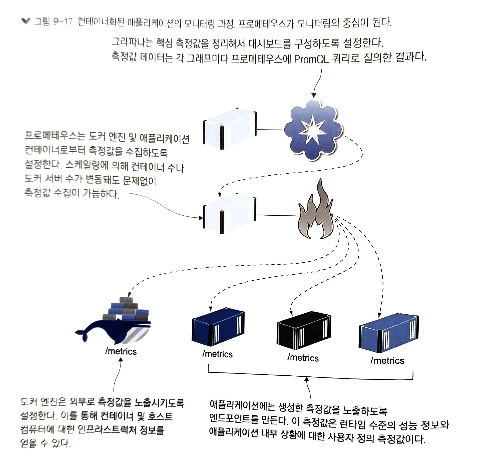

# 9장. 컨테이너 모니터링으로 투명성 있는 어플리케이션 만들기

---

## 9.1 컨테이너화된 애플리케이션에서 사용되는 모니터링 기술 스택

전통적인 어플리케이션 모니터링
- 서버의 목록, 현재 동작 상태(잔여 디스크 공간, 메모리와 CPU 사용량 등)가 표시된 대시보드
- 과부하, 응답 X 서버 발생 시 경보가 울림

컨테이너화된 애플리케이션
- 수십 ~ 수백 개의 컨테이너에 걸쳐 실행
- 컨테이너는 플랫폼에 의해 끊임없이 생성&삭제

---

### 프로메테우스(Ptometheus)

- 컨테이너 플랫폼과 연동해 실행 중인 애플리케이션을 볼 수 있는 도구
- CNCF(쿠버네티스와 컨테이너 런타임 containerd 관리)에서 개발 담당


프로메테우스를 사용하면 모니터링의 중요한 측면인 일관성 확보
- 모든 앱에서 똑같이 구성된 측정값 반환
- 윈도 컨테이너의 닷넷 앱/리눅스 컨테이너 Node.js 앱 -> 표준적인 형태로 모니터링

---

### 실습 : 프로메테우스를 컨테이너에서 실행해 현재 도커를 실행중인 컴퓨터의 정보를 수집

```
# 로컬 컴퓨터의 IP 주소를 확인해 환경 변수로 정의하기(MacOS)
hostIP=$(ifconfig en0 | grep -e 'inet\s' | awk '{print $2}')

# 환경 변수로 로컬 컴퓨터의 IP 주소를 전달해 컨테이너를 실행
docker container run -e DOCKER_HOST=$hostIP -d -p 9090:9090 diamol/prometheus:2.13.1
```

프로메테우스가 포함된 diamol/Prometheus 이미지 설정 중 DOCKER_HOST 환경 변수를 사용해 호스트 컴퓨터와 통신하고 도커 엔진의 상태 측정값을 수집

프로메테우스 웹 인터페이스 사용 시 
- 쿼리 작성 가능
- 상태별 컨테이너 수, 실패한 헬스 체크 수 확인 (고수준 정보)
- 도커 엔진이 점유중인 메모리 용량 (저수준 정보)
- 호스트 컴퓨터에 설치된 CPU 숫자, 인프라 정적 정보 포함

---

## 9.2 애플리케이션의 측정값 출력하기

앞선 장 : 도커 엔진의 측정 값을 프로메테우스로 출력
이번 장 : 앱의 유용한 정보를 측정 값으로 구성 -> HTTP 엔드포인트로 출력

프로메테우스 클라이언트 라이브러리
- 각 언어 별로 라이브러리 지원
    - Java : micrometer
    - Go : promhttp
    - Node : prom-client
- 프.클.라 통해 수집된 정보는 런타임 수준의 측정 값
    - Go : 현재 활성 상태인 고루틴의 갯수
    - Java : JVM이 사용중인 메모리 용량 정보

---

### 실습 : image-gallery 앱 프로메테우스 클라이언트 적용 버전을 실행해 측정값을 제공하는 엔트포인트 접근하기

```
cd ./ch09/exercise

# 모든 컨테이너를 제거한다
docker container rm -f $(docker container ls -aq)

# 도커 네트워크 nat을 생성한다
docker network create nat

# 앱을 시작한다
docker-compose up -d

# 웹 브라우저에서 http://localhost:8010에 접근하면 앱 화면이 나타난다
# http://localhost:8010/metrics에서는 측정값을 볼 수 있다
```

---

런타임 상태 측정값은 도커 엔진에서 얻은 인프라스트럭처 측정값과 또 다른 수준의 정보를 제공

마지막 측정값 : 앱에서 우리가 직접 노출시키는 핵심 정보로 구성된 앱 측정값
- 컴퍼넌트가 처리하는 이벤트 수, 평균 응답 처리 시간 같은 연산 중심의 정보
- 활성 사용자 수, 새로운 서비스 사용하는 사용자 수 같은 비즈니스 정보

```js
// 측정값 선언하기
const accessCounter = new prom.Counter({
    name: "access_log_total",
    help: "Access Log - 총 로그 수"
});

const clientIpGauge = new prom.Gauge({
    name: "access_client_ip_current",
    help: "Access Log - 현재 접속 중인 IP 주소"
});

// 측정값 갱신하기
accessCounter.inc();
clientIpGauge.set(countOfIpAddresses);
```

---

### 실습 : 앞서 실행한 image-gallery 앱이 현재 실행 중. 여기에 부하를 가한 다음 해당 앱의 측정값이 출력되는 엔드포인트에 접근하기

```
# 반복문을 돌며 다섯 번의 HTTP GET 요청을 보낸다.(리눅스)

for i in {1..5}; do curl http://localhost:8010 > /dev/null; done

# 웹 브라우저에서 http://localhost:8012/metric에 접근
```
---

어떤 값을 수집할 것인가?
- (만약 있다면) 외부 시스템과의 통신에 걸린 시간과 성공적으로 응답을 받았는지 여부에 대한 기록.
    - 이 측정값으로 외부 시스템이 앱의 속도나 이상 상태에 영향을 줬는지 알 수 있다.
- 로그로 남길 가치가 있는 모든 정보
    - 로그로 남기는 것보다, 측정값으로 수집하는 편이 메모리, 디스크 용량, CPU 시간 면에서 저렴하고 추세를 볼 수 있도록 시각화 하기도 쉽다.
- 사업 부서에 필요로 하는 앱의 상태 및 사용자 행동에 관한 모든 정보

---

## 9.3 측정값 수집을 맡을 프로메테우스 컨테이너 실행하기

프로메테우스는 직접 측정값을 대상 시스템에서 받아 수집하는 풀링 방식(스크래핑)

스크래핑 엔드포인트 설정
- 운영 환경 컨테이너 플랫폼 : 클러스터의 모든 컨테이너
- 단일 서버 도커 컴포즈 환경 : 서비스 목록으로 도커 네트워크 DNS를 통해 대상 컨테이너를 찾음

global.scrape_interval : 10s -> 스크래핑 간격 10초

설정 유형 두 가지

1. 정적 설정인 static_config : 호스트명으로 단일 컨테이너 지정
2. dns_sd_config : DNS 서비스 디스커버리 기능 -> 여러 컨테이너 지정, 스케일링에 따라 대상 컨테이너 자동 확대도 가능

---

컨테이너의 IP주소를 알기 위해 DNS를 사용하지만, image-gallery에 대한 설정은 단일 컨테이너를 대상으로 하는 설정이므로 이 컴포넌트에 스케일링을 적용하면 의도치 않은 동작을 보일 수 있다.

프로메테우스는 DNS 응답 중 가장 앞에 오는 IP 주소를 사용하므로 도커 엔진이 DNS 응답을 통해 로드 밸런싱을 적용한 경우 그 컨테이너 모두에서 측정값을 받아올 수 있다.


---

### 실습 : access-log 서비스의 공개 포트를 무작위로 설정하여 해당 서비스에 스케일링을 적용할 수 있는 도커 컴포즈 파일을 사용하여, 세 개의 컨테이너로 이 서비스를 실행하고 웹 어플리케이션에 부하를 가해보자.


```
docker-compose -f docker-compose-scale.yml up -d --scale accesslog=3

# HTTP GET 요청을 열 번 보냄(리눅스)
for i in {1..10}; do curl http://localhost:8010 > /dev/null; done
```

---

## 9.4 측정값 시각화를 위한 그라파나 컨테이너 실행하기

프로메테우스를 사용해 데이터를 수집한 후 해야 할 일

1. 프로메테우스 웹 UI : 측정값 열람, 데이터 시각화를 위한 쿼리 확인
2. 그라파나 : 대시보드 구성

---

### 실습 : 도커 컴포즈로 앱 실행 후 약간의 부하 주기

```
# 로컬 컴퓨터의 IP 주소를 환경 변수로 저장하기(리눅스)
export HOST_IP=$(ip route get 1 | awk '{print $NF;exit}')

# 그라파나가 포함된 컴포즈 파일로 앱 실행
docker-compose -f ./docker-compose-with-grafana.yml up -d --scale accesslog=3

# 측정값에 변화가 생기도록 부하를 약간 가하기(리눅스)
for i in {1..20}; do curl http://localhost:8010 > /dev/null; done

# 웹 브라우저에서 http://localhost:3000에 접근
```

---

해당 앱 대시보드에서 나타낸 측정값

1. HTTP 응답 코드 200으로 처리된 응답의 수
sum(image_gallery_requests_total{code="200"}) without(instance)

2. 현재 처리 중인 요청 수
sum(image_gallery_in_flight_requests) without(instance)

3. 메모리 사용량
go_memstats_stack_inuse_bytes{job="image-gallery"}

4. 활성 고루틴 수
sum(go_gorutines{job="image_gallery"}) without(instance)

---

## 9.5 투명성의 수준

실제 서비스가 가능한 수준으로 가려면 투명성(observatory)이 반드시 필요

도커를 익힌다는 것
- Dockerfile 스크립트 & 도커 컴포즈 스크립트 작성법을 배우는 것만을 의미하지는 않음
- 컨테이너를 중심으로 만들어진 생태계와 이들 생태계를 구성하는 도구를 적용하는 패턴

