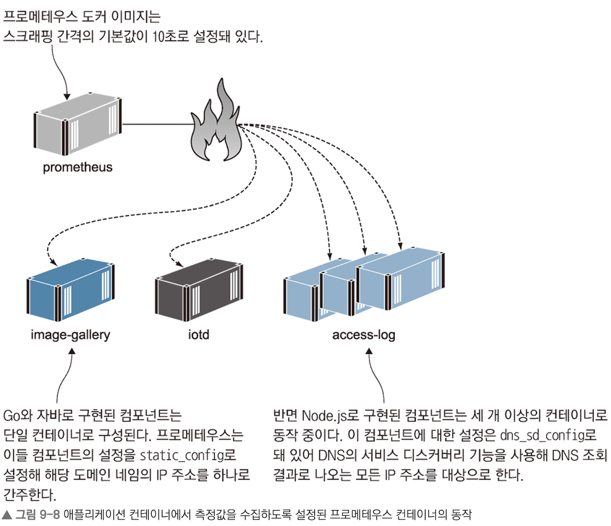
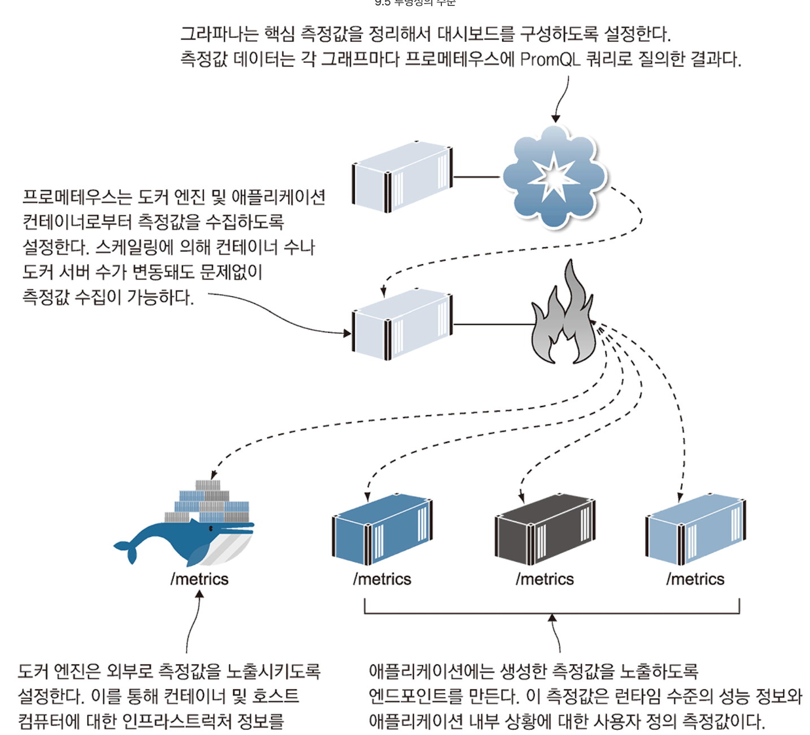

# 컨테이너 모니터링으로 투명성 있는 애플리케이션 만들기

## 최 혁

---

# 컨테이너화된 애플리케이션에서 모니터링하기

- 애플리케이션은 수십에서 수백개의 컨테이너에 걸쳐 실행되고, 컨테이너는 플랫폼에 의해 끊임없이 생성되고, 삭제된다.
- 따라서 컨테이너 플랫폼과 연동해 IP 주소 없이도 실행중인 애플리케이션을 들여다볼 방식이 필요하다.
- 프로메테우스를 활용하면 분산 애플리케이션을 모니터링할 수 있다.
- 프로메테우스 또한 컨테이너에서 동작한다.

---

# 컨테이너에서 동작하는 프로메테우스를 사용해 도커 엔진과 다른 컨테이너 모니터링하기

1. 컨테이너의 상태를 측정하는 API를 제공하도록 도커 엔진을 설정
2. 애플리케이션의 측정값을 외부로 공개하는 API를 포함해 컨테이너 생성
3. 프로메테우스를 통해 애플리케이션 컨테이너로부터 데이터 수집 및 저장
   (프로메테우스 컨테이너를 만들 때 측정값을 외부로 공개하는 API를 포함해야 함)

---

# 프로메테우스를 사용하여 모니터링할 때 장점

- 모든 컨테이너를 똑같이 표준적인 형태로 모니터링할 수 있다.
- 도커 엔진의 측정값도 같은 형식으로 추출할 수 있다.
  - 컨테이너 플랫폼에서 벌어지는 일도 파악 가능
  - /etc/docker 디렉터리에 daemon.json 파일의 Daemon 항목에 설정을 수정하면 된다.

```json
    "metrics-addr" : "0.0.0.0:9323",
    "experimental": true
```

---

# 측정값 수집을 맡을 프로메테우스 컨테이너 실행하기

```yaml
# prometheus.yml
# 프로메테우스는 직접 측정값을 대상 시스템에서 받아 수집하는 풀링 방식으로 동작하는데 이 과정을 스크래핑이라 함
global:
    scrape_interval: 10s    # 스크래핑 간격을 10초로 설정

scrape_configs:
    - job_name: "image-gallery"
      metrics_path: /metrics
      static_configs:
        - targets: ["image-gallery"]

    - job_name: "iotd-api"
      metrics_path: /actuator/prometheus
      static_configs:
        - targets: ["iotd"]

dns_sd_configs:     # DNS 서비스 디스커버리 기능을 통해 여러 컨테이너를 지정할 수 있다.
    - names:
        - accesslog
          type: A
          port: 80
```

---



---


