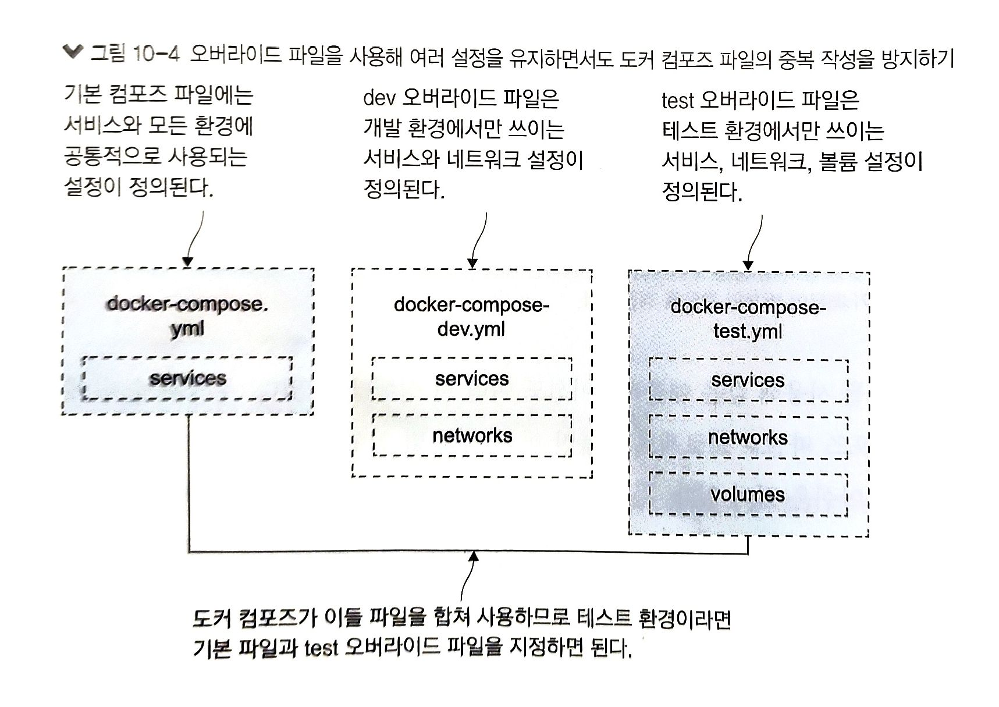

# 10장. 도커 컴포즈를 이용한 여러 환경 구성

운영 환경을 위한 설정이 필요 없는 환경도 있음
이식성은 도커의 가장 핵심적인 장점
컨테이너로 실행하기 위해 패키징된 앱은 어떤 환경에 앱을 배포해도 동일하게 동작

환경 변화는 수동에 의존하는 소프트웨어 배포에서 불가피하게 발생
특정 업데이트가 누락되거나 의존 모듈이 빠질 수도 있는 등 사용자 테스트 환경은 운영 환경과 다름

---

## 10.1 도커 컴포즈로 여러 개의 앱 배포하기

도커 컴포즈는 여러 개의 컨테이너에서 구성된 앱을 단일 도커 엔진 호스트에서 실행하기 위한 도구

예를 들어 
- 운영 환경 : 1.5
- 핫픽스 테스트 환경 : 1.5.1
- 사용자 테스트 환경 : 1.6
- 시스템 테스트 환경 : 1.7

이렇게 각기 다른 환경에서 같은 앱을 구동해야 할 때가 발생. 비운영 환경은 스케일링이 필요 없음 -> 이러한 비 운영 환경에서 도커 컴포즈가 활약

이런 경우 환경마다 앱이 다르게 동작하게 해야 한다. 
예를 들어, 여러 컨테이너가 같은 포트를 통해 요청을 받거나, 서버에 있는 같은 파일을 여러 컨테이너가 쓰려 해서는 안 된다. 

---

도커 컴포즈는 도커 리소스가 어떤 앱의 일부인지 아닌지를 판정하기 위해 프로젝트(project)라는 개념 사용

예시) 컴포즈 파일이 포함된 디렉터리명이 app1이고, 이 컴포즈 파일에 정의된 서비스가 web, 볼륨이 disk라면 컴포즈가 실제 이 앱을 실행할 때 app1_disk 라는 볼륨과 app1_web_1 이라는 컨테이너를 만든다.
- 만약 서비스 web의 컨테이너를 두 개로 늘렸다면 새로 추가되는 컨테이너 이름은 app1_web_2가 된다. 

---

### 실습 : 지금 to-do 앱이 하나 실행 중. 프로젝트 이름을 기본 값에서 바꿔 앱을 하나 더 실행 가능

```
docker-compose -f ./todo-list/docker-compose.yml -p todo-test up -d

docker container ls

docker container port todo-test_todo-web_1 80
```

프로젝트 이름을 따로 지정해 주었기 때문에 컴포즈의 입장에서 이 앱은 기존에 실행 중인 것과 별개가 된다.
그리고 새로운 프로젝트 이름과 일치되는 리소스가 없기 때문에 새로운 컨테이너를 실행하게 된다.

---

## 10.2 도커 컴포즈의 오버라이드 파일

도커 컴포즈는 여러 파일을 합쳐 컴포즈 파일을 구성하는데, 나중에 지정된 파일의 내용이 이전 파일의 내용을 오버라이드(override), 즉 덮어 쓰기한다.



---

앱의 대부분의 속성이 정의된 기본 컴포즈 파일과 특정 환경에서만 적용할 설정이 담긴 오버라이드 파일의 예시 코드.

오버라이드 파일의 정의에 따라 to-do 앱의 v2 태그를 갖는 이미지가 사용된다.

```
# docker-compose.yml - 기본 파일
services:
    todo-web:
        iamge: diamol/ch06-todo-list
        ports:
            - 80
        environment:
            - Database:Provider=Sqlite
        networks:
            - app-net
# docker-compose-v2.yml - 오버라이드 파일
services:
    todo-web:
        image: diamol/ch06-todo-list:v2
```
---

오버라이드 파일에는 해당 환경에서 변경할 항목만 기술하면 된다.
그러나, 기본 컴포즈 파일의 구소를 유지해야 도커 컴포즈가 두 정의를 연결 지을 수 있다.

도커 컴포즈가 오버라이드 파일을 병합하는 순서는 인자로 받은 순서를 따른다. 파일의 순서를 잘못 나열하면 원치 않는 결과를 얻는다.

도커 컴포즈는 클라이언트에서 동작하는 도구다. 그러므로 앱을 관리하려면 컴포즈 파일에 접근이 가능해야 하며, 앱을 실행할 때 지정한 프로젝트 이름도 알고 있어야 한다.

---

## 10.3 환경 변수와 비밀값을 이용해 설정 주입하기

---

## 10.4 확장 필드로 중복 제거하기

---

## 10.5 도커를 이용한 설정 워크플로 이해하기