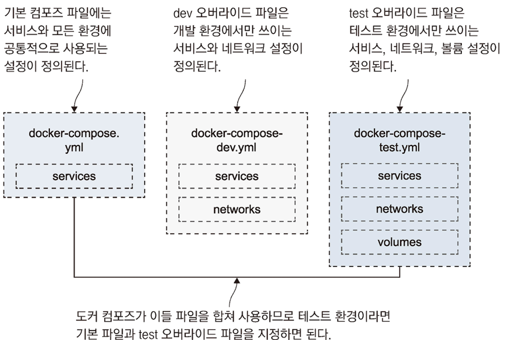

# 도커 컴포즈를 이용한 여러 환경 구성

## 최 혁

---

# 도커 컴포즈로 여러 개의 애플리케이션 배포하기

- 도커 컴포즈는 도커 리소스가 어떤 애플리케이션의 일부인지 아닌지를 판정하기 위해 project라는 개념을 사용한다.
- 이를 통해 애플리케이션이 이미 떠있으면 새롭게 만들지 않는다.
- 만약 같은 애플리케이션을 여러 번 실행하고 싶다면 이름을 바꿔야 한다.
  - `-p` 옵션을 통해 프로젝트 이름을 변경할 수 있다.
  - `docker compose -f ./todo-list/docker-compose.yml -p todo-test up -d`
- 프로젝트 이름의 기본값: 리소스 이름 + 번호(스케일링을 위해)

---

# 도커 컴포즈의 오버라이드 파일

- 하나의 애플리케이션을 여러 설정으로 실행해야 할 필요가 생긴 경우 대부분은 컴포즈 파일을 여러 개 두는 방법을 사용하지만, 이는 유지보수 측면에서 좋지 않다.
- 컴포즈 파일의 내용은 90% 이상이 중복이니 수정 시 누락이 발생한다면 환경 차이 문제가 발생한다.
- 도커 컴포즈는 여러 파일을 합쳐 컴포즈를 구성하는데, 나중에 지정된 파일의 내용이 이전 파일의 내용을 오버라이드한다.
- 이를 통해 여러 환경에 대한 설정을 담으면서 유지보수성이 좋은 컴포즈 파일을 만들 수 있다.

---



---

# 속성 하나를 변경하는 도커 컴포즈 오버라이드 파일

```yaml
# docker-compose.yml - 기본 파일
services:
    todo-web:
        image: diamol/ch06-todo-list
        ports:
          -  80
        environment:
          -  Database:Provider=Sqlite
        networks:
          -  app-net

# docker-compose-v2.yml - 오버라이드 파일(이미지 버전 변경 기능이 있음)
services:
    todo-web:
        image: diamol/ch06-todo-list:v2
```

---

# 오버라이딩을 통해 도커 컴포즈 파일 병합

- 도커 컴포즈는 하나 이상의 파일이 인자로 지정됐을 때 이들 파일을 병합한다.
- config 부명령을 통해 입력 파일의 내용을 검증해 내용이 유효한 경우만 최종 출력을 내놓는다.
- config 부명령은 애플리케이션을 실제로 실행하지는 않는다.
- 도커 컴포즈가 오버라이드 파일을 병합하는 순서는 인자로 받은 순서를 따른다.

`docker compose -f ./todo-list/docker-compose.yml -f ./todo-list/docker-compose-v2.yml config`

---

# 도커 컴포즈 실정 활용 예시

- `docker-compose.yml`: 기본 컴포즈 파일. 웹 및 API 서비스가 정의됐으나 포트나 도커 네트워크에 대한 정의는 빠져이다.
- `docker-compose-dev.yml`: 개발 환경 대상의 설정. 도커 네트워크 및 서비스의 공개 포트를 정의하고 헬스 체크와 디펜던시 체크를 비활성화한다.
- `docker-compose-test.yml`: 테스트 환경 대상의 설정. 도커 네트워크를 정의하고, 헬스체크를 설정하고, 웹 서비스의 공개포트를 정의한다. API 서비스의 포트는 공개하지 않는다.
- `docker-compose-uat.yml`: 사용자 인수 테스트 환경 대상의 설정. 도커 네트워크를 설정하고, 웹 서비스는 80번 표준 포트로 공개한다.

---

# 개발 환경용 애플리케이션 실행 및 제거하기

- 개발 환경용 설정으로 실행하기

`docker compose -f ./numbers/docker-compose.yml -f ./numbers/docker-compose-dev.yml -p numbers-dev up -d`

- 개발 환경용 애플리케이션 제거하기

`docker compose -f ./numbers/docker-compose.yml -f ./numbers/docker-compose-dev.yml -p numbers-dev down`

---

# 환경 변수와 비밀값을 이용해 설정 주입하기

```yaml
services:
  todo-web:
    image: diamol/ch06-todo-list
    secrets:
      - source: todo-db-connection # 컨테이너 런타임이 비밀값을 읽어오는 곳
        target: /app/config/secrets.json # 컨테이너 안에서 비밀값이 위치할 경로
```

- 비밀값은 도커 컴포즈, 도커 스웜, 쿠버네티스에서 모두 지원하는 기능으로, 설정값을 주입하기에 매우 유용한 기능이다.
- todo-db-connection 파일이 정의돼 있지 않기에 단독으로 사용하면 유효하지 않다.

---

# 개발 환경만을 위한 추가 설정과 비밀값이 정의된 오버라이드 파일

```yaml
services:
  todo-web:
    ports:
      - 8089:80
    environment:
      - Database:Provider=Sqlite # 컨테이너 안에서만 사용되는 환경 변수 추가
    env_file:
      - ./config/logging.debug.env # 이 파일에 정의된 환경변수가 컨테이너에 적용

secrets:
  todo-db-connection:
    file: ./config/empty.json
```

---

## 호스트 컴퓨터의 환경변수 값을 사용한 컴포즈 파일

```yaml
todo-web:
  ports:
    - "${TODO_WEB_PORT}:80"
```

## 환경 파일을 이용해 컨테이너 설정값 및 도커 컴포즈 실행 옵션 적용하기

```yaml
# ~~~.env 파일
TODO_WEB_PORT=8877
TODO_DB_PORT=5433
```
