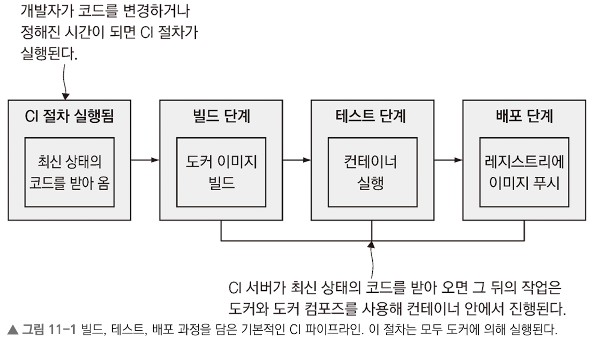

# 도커와 도커 컴포즈를 이용한 애플리케이션 빌드 및 테스트

## 최 혁

---

# 도커를 이용한 지속적 통합 절차

- 도커는 CI 절차의 일관성을 유지해 준다.
  
- 도커화된 CI 절차에서 모든 일은 컨테이너 안에서 진행되지만, 전체 절차를 수행하려면 중앙 집권적 형상 관리 시스템, 이미지를 저장할 도커 레지스트리, CI 작업을 수행할 자동화 서버 등의 인프라가 필요하다.

---

# 도커를 이용한 빌드 인프라스트럭처 구축하기

- 형상 관리 기능을 제공하는 Gogs, 이미지 배포를 맡은 오픈 소스 도커 레지스트리, 자동화 서버인 젠킨스를 docker compose로 구성하여 ci 환경을 구축할 수 있다.
- 전체 CI 파이프라인이 도커 컨테이너를 통해 연결했을 때 이점
  - 도커에서 실행된 컨테이너는 도커 API, 같은 도커 엔진에서 실행된 컨테이너와 연결되기에 도커 명령을 실행하면 호스트 컴퓨터에서 실행중인 도커 엔진으로 전달된다.
  - 도커 CLI는 도커 API를 호출하는 방식으로 동작하기에 다른 곳에 위치한 CLI도 같은 도커 엔진에 접속할 수 있다.

---

# 젠킨스에 포함된 도커 CLI를 도커 엔진과 연결하기

1. 도커 CLI가 로컬 호스트에서 실행 중인 도커 API에 접속 시도
2. 이 때 통신과정은 호스트 컴퓨터 안으로 국한된 채널 사용(리눅스 환경에서는 소켓을 사용)
3. 이를 통해 컨테이너에서 실행된 애플리케이션이 도커를 통해 다른 컨테이너를 찾아달라고 요청

```yaml
# docker-compose.yml
services:
  jenkins:
    image: diamol/jenkins
    ports:
      - "8080:8080"
    networks:
      - infrastructure

# docker-compose-linux.yml
jenkins:
  volumes:
    - type: bind
      source: /var/run/docker.sock
      target: /var/run/docker.sock
```

---

# 도커 컴포즈를 이용한 빌드 설정

**이미지 태그에 환경 변수가 사용된 코어 컴포즈 파일**

```yml
services:
    numbers-api:
        image: ${REGISTRY:-docker.io}/diamol/
        ch11-numbers-api:v3-build-${BUILD_BUMBER:-local}
```

- `${REGISTRY:-docker.io}`: 이 부분을 환경 변수 REGISTRY의 값으로 치환하되, 해당 환경 변수가 없다면 도커 허브의 도메인인 docker.io를 기본값으로 사용하라는 의미

---

# 도커 레이블

- 컨테이너, 이미지, 네트워크 볼륨 등 대부분의 도커 리소스에는 레이블을 부여할 수 있다.
- 이 레이블은 리소스에 대한 추가 데이터에 키-값 쌍 형태로 저장된다.
- 이미지를 레지스트리에 푸시하거나 내려받으면 레이블도 함께 따라온다.

```dockefile
AGE BUILD_NUMBER=9
LABEL version="3.0"
```

**도커파일 스크립트**
`LABEL`: 도커파일 스크립트에 정의된 키-값 쌍을 빌드되는 이미지에 적용해준다.
`ARG`: 이미지를 빌드하는 시점에만 유효하다는 점을 제외하면 ENV instruction과 거의 같다.(빌드된 이미지로 실행한 컨테이너에서는 이 환경변수가 정의되지 않는다.)

---

# 빌드 설정값과 재사용 가능한 인자가 적용된 컴포즈 파일

```yaml
x-args: &args
  args:
    BUILD_BUMBER: ${BUILD_NUMBER:-0}

services:
  numbers-api:
    build:
      context: numbers
      dockerfile: numbers-api/Dockerfile.v4
      <<: *args
```

- context: 도커가 빌드 중에 사용할 작업 디렉터리 경로. 상대 경로일 경우 컴포즈 파일의 경로를 기준으로 한다.
- dockerfile: Dockerfile 스크립트의 경로. 상대 경로일 경우 context에서 지정된 경로를 기준으로 한다.
- args: 빌드 시에 전달할 인자. Dockerfile 스크립트에서 ARG instruction으로 정의된 키와 일치해야 한다.

---

# CI 파이프라인에 관계된 컨테이너

- 도커를 사용하면 애플리케이션 빌드 프로세스의 최상위 레이어가 항상 동일하기에 CI 파이프라인에 다양하고 유용한 기능을 추가할 수 있다.

### 일반 배포를 위한 보안 검사가 추가된 실제 운영 수준의 CI 파이프라인 `(안전 소프트웨어 공급 체인)`

1. 도커 이미지 빌드 [빌드]
2. 컨테이너에서 테스트 수행 [테스트]
3. 스테이징 레지스트리에 이미지 푸시 [사내 배포]
4. 취약점 탐지 및 보안 정책 준수 확인 [이미지 검증]
5. 이미지에 디지털 서명 추가 [이미지 사이닝]
   (이미지가 검증을 통과하고 배포 가능한 상태임을 인증하는 디지털 서명 추가)
6. 일반 레지스트리에 이미지 푸시 [일반 배포]
