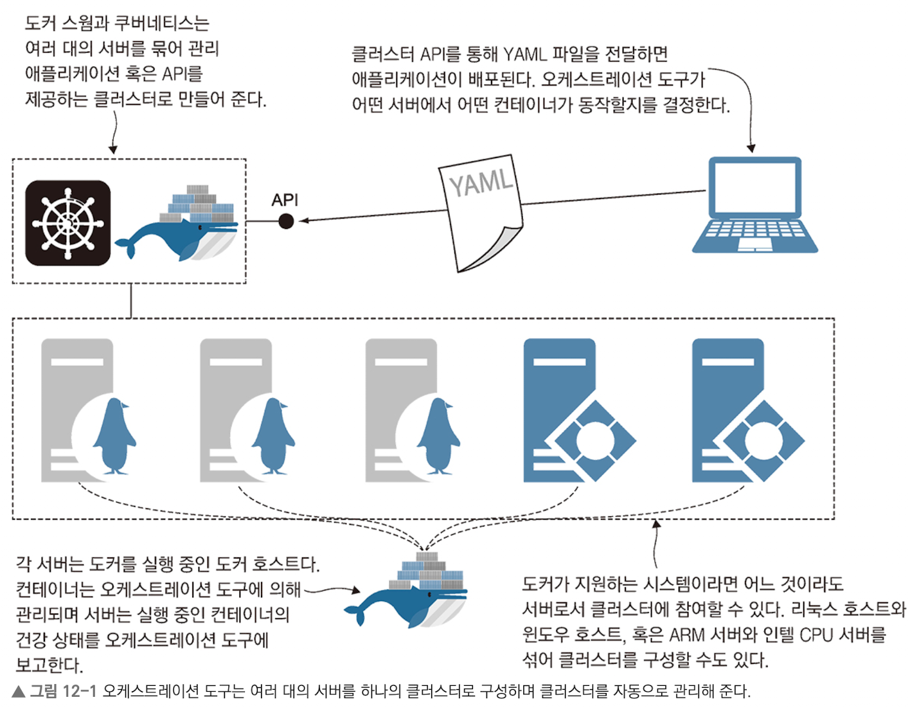
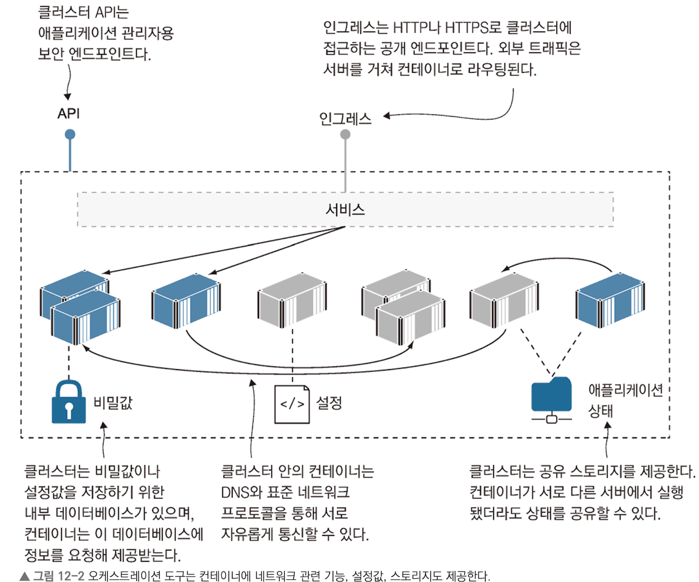

# 컨테이너 오케스트레이션: 도커 스웜과 쿠버네티스

## 최 혁

---

# 컨테이너 오케스트레이션 도구란?

    오케스트레이션: 여러 대의 도커 호스트와 컨테이너를 관리해주는 관리 레이어

**오케스트레이션 도구**

- 클러스터를 구성하는 여러 대의 호스트 컴퓨터를 의미
- 컨테이너를 관리하고 서비스를 제공하기 위한 작업을 여러 컴퓨터에 분배하며, 네트워크 트래픽 부하를 고르게 분산시키고, 상태가 불량한 컨테이너를 새 컨테이너로 교체하는 일을 담당

---



---

# 클러스터

### 클러스터 구성요소

- 애플리케이션에 대한 모든 정보가 담긴 `분산 데이터베이스`
- 어떤 컨테이너를 어떤 호스트에서 실행할지 배정하는 `스케줄러`
- 클러스터를 구성하는 호스트 간에 주기적으로 연락을 주고받는 시스템

### 클러스터에 애플리케이션 배포

1. 클러스터에 YAML 파일 전달
2. 클러스터는 애플리케이션 구성 정보를 저장하고, 그에 맞춰 서버에 컨테이너를 생성해 애플리케이션 실행
3. 애플리케이션이 실행되면 애플리케이션의 실행 상태가 유지되도록 관리

---



---

# 오케스트레이션 도구를 사용할 때 장점

- 어떤 서버에 몇 개의 컨테이너를 실행해야 할 지 신경쓰지 않아도 된다.
- 네트워크 관련 기능, 애플리케이션 설정 기능, 데이터 저장 기능도 제공한다.
- 오케스트레이션 도구는 각 서버, 네트워크, 스토리지 장치의 세부사항을 가려준다.
  => 우리는 클러스터가 하나의 대상인 것처럼 명령행 도구와 API를 통해 명령을 보내고 쿼리를 요청할 수 있다.

---

# 도커 스웜으로 클러스터 만들기

- 도커 엔진을 스웜모드로 전환하면 도커 스웜을 사용할 수 있다.
- 클러스터에 속한 컴퓨터는 매니지와 워커 중 하나의 역할을 맡는다.
- 스웜을 만들면 원하는 만큼 컴퓨터를 스웜에 추가할 수 있다.(스웜에 추가된 컴퓨터: 노드)
- 스웜에 노드를 추가하려면 해당 컴퓨터가 스웜과 같은 네트워크상에 있어야 하고, 패스워드 역할을 하는 참가 토큰을 매니저로부터 발급받아야 한다.
- 도커 스웜이 쿠버네티스보다 나은 점 중 하나는 클러스터를 구성하고 관리하는 작업이 단순하다.

```shell
# 스웜모드로 전환
docker swarm init

# 노드로 스웜에 참여하기 위한 명령을 화면에 출력(worker, manager)
docker swarm join-token worker(or manager)

# 스웜에 참여중인 노드의 목록을 출력
docker node ls
```

---

# 도커 스웜 서비스로 애플리케이션 실행하기

- 스웜에서 말하는 서비스는 컴포즈의 서비스와 같은 개념이다.
- 서비스는 사용되는 이미지, 환경 변수와 값, 공개되는 포트와 같은 컨테이너 정보로 정의된다.
- 서비스의 이름 또한 도커 네트워크상에서 그대로 도메인으로 사용된다.
- 컴포즈 서비스와 다른 점은 여러 개의 레플리카(서비스와 똑같이 설정되지만 스웜상의 여러 노드에 흩어져 배치될 수 있다)를 가질 수 있다.

```shell
# 컨테이너 하나를 실행하는 서비스 만들기
docker service create --name timecheck --replicas 1 diamol/ch12-timecheck:1.0

docker service ls
```

---

# 서비스

- 서비스는 도커 스웜의 일급 객체이지만, 서비스를 다루려면 도커 엔진이 스웜 모드이거나 스웜 매니저에 연결된 상태여야 한다.
- 서비스를 구성하는 컨테이너를 `레플리카`라고 부른다.

```shell
# 이 서비스의 래플리카 목록 확인
docker service ps timecheck
```

- 레플리카 조회 이후 수동으로 그 컨테이너(레플리카)를 삭제하면 스웜은 서비스의 레플리카가 부족하다고 판단하고 새 레플리카를 실행한다.
- 도커 엔진을 스웜 모드로 전환했다면 애플리케이션을 서비스로 보고 각각의 컨테이너를 관리하는 것은 스웜에 맡겨야 한다.

---

# 도커 스웜

- 도커 컴포즈와 스웜의 다른 점은 애플리케이션 정의를 저장할 공간을 로컬 컴퓨터의 YAML 파일로 갖고 있는지 여부이다. 스웜 모드에서는 애플리케이션 정의가 클러스터에 저장된다.
- 모든 컨테이너 오케스트레이션 도구는 애플리케이션을 업데이트할 때 애플리케이션을 중단시키지 않고 점진적으로 컨테이너를 교체해 나가는 롤링 업데이트 방식을 사용한다.
- 스웜에서는 한 번에 한 레플리카씩 교체하는 방식을 사용하는데 설정으로 조정 가능하다.

---

# 오버레이 네트워크

- 컨테이너에서 실행되는 애플리케이션의 입장에서 스웜 모드의 네트워크는 TCP/IP 방식이다.
- 컴포넌트는 도메인 네임을 통해 요청을 주고받지만, 컨테이너와 컨테이너에서 실행중인 애플리케이션은 이를 신경 쓸 필요가 없다.
- 스웜 모드에서는 `오버레이 네트워크`라는 새로운 형태의 도커 네트워크를 사용할 수 있다.
- 오버레이 네트워크는 클러스터에 속한 모든 노드를 연결하는 가상 네트워크이다.
- 오버레이 네트워크 자체는 서로 독립적이기에 서로 다른 네트워크에 속한 서비스는 통신이 불가능하다.

---

# 실습

```shell
docker service create --detach --replicas 3 --network iotd-net --name
iotd diamol/ch09-image-of-the-day

docker service create --detach --replicas 2 --network iotd-net --name
accesslog diamol/ch09-access-log

docker service ls
```

---

# VIP 네트워크

- 도커 스웜은 서비스 접근에 대한 신뢰성을 높이고 부하를 잘 분산시키기 위해 VIP 네트워크를 사용한다.
- 서비스 접근을 위해 DNS 조회를 하면 하나의 IP 주소만 조회된다. 클라이언트가 이 IP 주소로 요청을 보내면, 운영체제의 네트워크 계층에서 이 IP 주소의 종착점이 여러 곳임을 파악하고 그 중 하나를 결정해준다.
- 스웜은 `인그레스 네트워킹 방식`을 사용한다. 인그레스 네트워크는 스웜을 구성하는 모든 노드가 서비스가 공개한 포트를 감시하는 방식으로 동작한다.
- 서비스를 생성할 때 공개할 포트를 지정하기만 하면 인그레스 네트워크를 사용할 수 있다.
