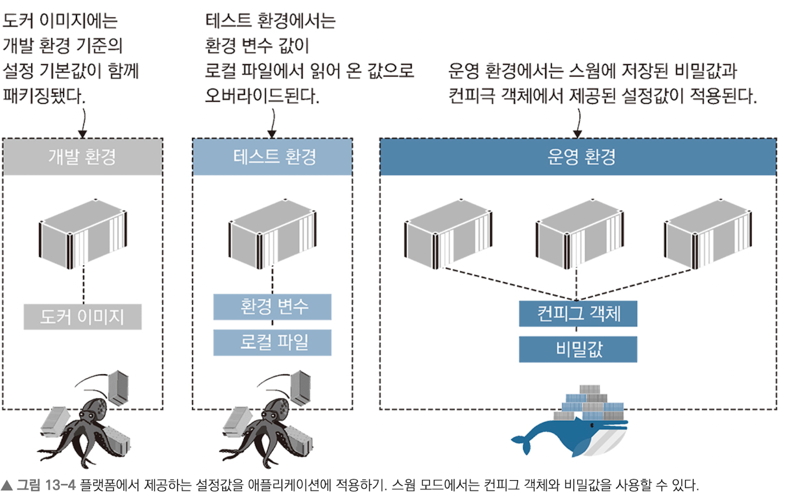
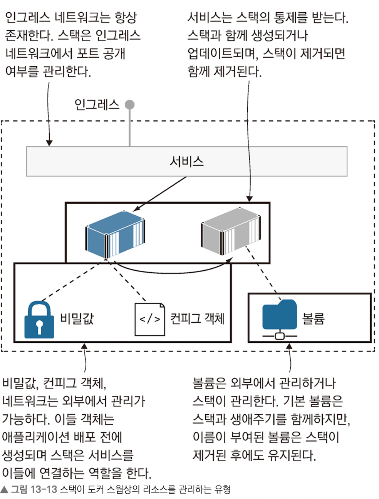

# 도커 스웜 스택으로 분산 애플리케이션 배포하기

## 최 혁

---

# 도커 컴포즈를 사용한 운영 환경

- 컴포즈 파일만으로 스웜에 애플리케이션을 배포할 수 있다.
- 스웜 모드에서 애플리케이션을 배포하면 레플리카 하나를 실행중인 서비스가 생성되고, 이 서비스는 인그레스 네트워크를 통해 포트를 공개하고 있다.
- 스웜 모드에서 애플리케이션을 배포할 때 `스택`(서비스, 네트워크, 볼륨 등 여러 개의 도커 리소스를 묶어 만든 리소스)을 만든다.
- 스웜 모드에서 스택은 일급 리소스이다.

```shell
# 컴포즈 파일로 스택 배포
docker stack deploy -c ./todo-list/v1.yml todo
```

---

# 도커 컴포즈를 사용한 운영 환경

- 스웜에 노드가 두 개 이상이라면 고가용성을 확보할 수 있다.(서비스 레플리카에 대한 고가용성)
- 컴포즈 파일에 deploy 프로퍼티를 추가하여 스택을 배포할 때의 설정을 추가할 수 있다.
- 도커 컨테이너는 상한치를 지정하지 않는 한 컴퓨터의 CPU와 메모리를 무제한으로 사용할 수 있다.

```yaml
services:
  todo-web:
    image: diamol/ch06-todo-list
    deploy:
      replicas: 2
      resources:
        # 아래 제약은 컨테이너가 시작될 때만 적용 가능하다.
        limits:
          cpus: "0.50"
          memory: 100M
```

---



---

# config 객체를 이용한 설정값 관리

- 스웜에서는 설정값을 위해 docker config 객체가 쓰인다.
- config 객체는 컨테이너가 설정값을 클러스터에서 읽어올 수 있게 해줌과 동시에 애플리케이션 배포와 설정 관리를 분리시킨다.
- config 객체는 스웜에 의해 컨테이너 파일 시스템 내의 파일로서 전달된다.
- config 객체는 객체의 이름과 설정값이 담긴 파일 경로를 지정하여 만들 수 있다.
- JSON 형식 이외에 key-vlaue, 바이너리 파일까지 다양한 포멧으로 담을 수 있다.

```shell
# 로컬에 위치한 JSON 파일로 config 객체를 만든다.
docker config create todo-list-config ./todo-list/config.json
```

---

# config 객체

- config 객체는 1급 객체로써 내용을 모두 볼 수 있기에 민감한 데이터를 보관할 수단으로 사용하면 안 된다.

```shell
# --pretty 태그로 config 객체 내용을 볼 수 있다.
docker config inspect --pretty todo-list-config
```

컨피그 객체는 컨테이너 파일 시스템을 통해 서비스로 전달된다.

```yaml
services: ~~

configs:
  todo-list-config:
    external: true
```

---

# 비밀값

- 비밀값은 config 객체와 같이 클러스터의 관리를 받는 스웜 리소스이다.
- config 객체와의 차이점은 비밀값이 컨테이너에 전달된 상테에서만 복호화된 비밀값을 볼 수 있다는 점이다.

```shell
docker secret create todo-list-secret ./todo-list/secrets/secrets.json

docker secret inspect --pretty todo-list-secret
```

---

# config 객체나 비밀값 업데이트

    config 객체와 비밀값은 수정이 불가능하다.

config 객체나 비밀값 변경 방법

1. 변경된 내용을 담은 새로운 config 객체 혹은 비밀값을 기존과 다른 이름으로 만든다.
2. 컴포즈 파일의 정의에 사용된 config 객체 혹은 비밀값 이름을 새로운 이름으로 바꾼다.
3. 변경된 컴포즈 파일로 스택에 배포한다.

(참고로 쿠버네티스는 클러스터에 저장된 기존 config 객체나 비밀값 변경이 가능하다.)

---

# 스웜에서 도커 볼륨 사용하기

- 컴포즈 파일의 서비스 정의에 볼륨 마운트를 정의하면 레플리카에서 볼륨을 로컬 파일 시스템의 디렉터리처럼 사용할 수 있다.
- 클러스터는 여러 개의 노드로 구성되고, 이들 노드는 각각의 디스크가 있어서 이 디스크에 로컬 볼륨을 저장한다.
- 어떤 레플리카를 대체하는 새로운 레플리카가 이전 레플리카와 다른 노드에서 실행되는 경우 기존 로컬 볼륨에 접근할 수 없다. -> 노드에 레이블을 부여하고 컴포즈 파일에서 해당 노드에서만 레플리카를 실행하도록 강제하면 된다.

---


