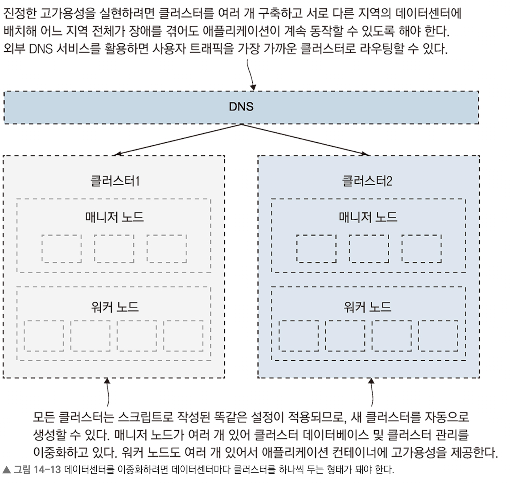

# 업데이트와 롤백을 이용한 업데이트 자동화

## 최 혁

---

# 도커 스웜 롤링 업데이트

- 빌드 파이프라인을 자동화하면 항상 최신 버전의 SDK, 런타임, 운영체제가 반영된 즉시 배포 가능한 이미지를 가질 수 있다.
- 성공적인 배포를 위해서는 헬스 체크가 필수이다. (롤링 업데이트에 헬스 체크 기능이 없다면 그 업데이트가 성공했는지 클러스터 입장에서 알 방법이 없다.)
- 도커 스웜의 롤링 업데이트는 섬세하게 결정된 기본값에 따라 동작한다.
- 레플리카는 하나씩 교체되며 새 컨테이너가 정상적으로 실행되는지 확인이 끝난 후 다음 컨테이너 업데이트에 들어간다.
- 롤링 업데이트는 새 컨테이너가 실행되기 전에 기존 컨테이너를 종료하는데, 새 컨테이너가 정상적으로 실행되지 않으면 전체 업데이트가 중단된다.

---

# 운영 환경을 위한 롤링 업데이트 설정

**롤링 업데이트 커스텀의 예**

```yaml
numbers-api:
  deploy:
    update_config:
      parallelism: 3 # 한 번에 교체하는 레플리카의 수
      monitor: 60s # 새로 실행한 컨테이너의 이상 여부를 모니터링하는 시간
      failure_action: rollback
      order: start-first # 레플리카를 교체하는 절차의 순서
```

---

# 서비스 롤백 설정하기

- 애플리케이션을 이전 상태로 되돌리는 것은 서비스 단위로 이루어진다.
- 대개 롤백은 자동화된 롤링 업데이트 과정에서 새로 투입한 레플리카가 모니터링 중 오류를 일으켰을 때 수행한다.

---

# 클러스터의 중단시간

- 컨테이너는 각각의 컴퓨터에서 실행되므로 중단 시간이 발생할 수 있다.
- 스웜에서 drain은 노드를 유지보수 모드로 전환한다.
- drain 모드가 되면 해당 노드에서는 레플리카가 종료되고 새로운 레플리카를 실행하지도 않는다.

---


