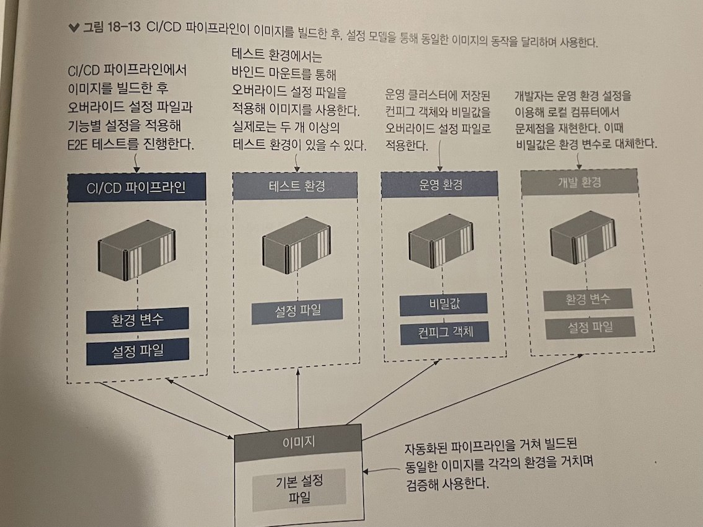

## 18장 컨테이너의 애플리케이션 설정 관리
18.1 다단 애플리케이션 설정
18.2 환경별 설정 패키징하기
18.3 런타임에서 설정 읽어 들이기
18.4 레거시 애플리케이션에 설정 전략 적용하기
18.5 유연한 설정 모델의 이점

---

## 다단 애플리케이션 설정

### 설정 데이터의 종류
- 버전에 따라 달라지는 설정
- 환경에 따라 달라지는 설정
- 기능 설정

```
{
  "release": "19.12",        # 버전에 따라 달라지는 설정 - 릴리스 단계 정보
  "environment": "DEV",      # 환경별로 달라지는 설정값 - 환경 이름
  "metrics": {               # 기능 설정 - 통계 수집 여부
    "enabled": true
  }
}
```

---
## 다단 애플리케이션 설정(cont.)
기본 설정(config)을 구성한 뒤, 볼륨에 오버라이드 설정파일(config-override)을 마운트하고, 환경변수를 조합하여 컨테이너를 설정할 수 있다.


(node-config 기준 설명)
`config`  -  도커 이미지에 포함되는 기본 설정.
`config-override` - 이미지에는 포함되지 않는다. 볼륨, 컨피그 객체, 비밀값 등을 통해 컨테이너 파일 시스템에 주입되는 설정이다.


---
## 환경별 설정 패키징하기
환경 별로 서로 다른 설정 파일을 두고, 환경변수를 사용해서 이를 적용할 수 있다.
이 경우 설정파일이 이미지에 함께 패키징 되어 있어서, 별도의 설정을 외부에서 주입할 필요 없다.
다만 이미지에 설정 파일을 모두 포함시키는 방법은 보안 상 위험이 클 수 있기 때문에 신중히 고려해야 함

(닷넷 코어 기준 설명)
`appsettings.json` (공통 설정) 
`appsettings.{환경이름}.json` (환경별로 적용되는 오버라이드 파일)


--- 

### 런타임에서 설정 읽어 들이기
(Go 기준 설명)
- 이미지에 포함된 config 디렉터리에서 기본 설정 읽어들임
- 환경별 설정 파일은 config-override 디렉터리에서 읽어들임
  - 이미지에서는 빈 디렉터리임. 파일 시스템 마운트로 외부에서 주입됨.
- 환경변수는 설정 파일의 설정값을 오버라이드 할 수 있음

Viper 설정모듈에서는 JSON, YAML 뿐만 아니라 TOML도 지원.

(TOML의 장점? )
가독성. 코드에서 편리하게 디렉터리를 지정할 수 있음. 
디버깅이 쉬움. 버전별 설정 차이 확인하기 쉬움.

---

### 설정 API 기능
애플리케이션에 계층별 설정을 적용했을 경우, 설정 API 기능을 유용하게 활용할 수 있다.
(유의 사항)
- 전체 설정을 공개하지 않는다. 민감한 정보는 제외.
- 허가받은 사용자만이 접근할 수 있도록 엔드포인트에 보안 설정.
- 설정API의 사용 여부를 설정할 수 있게 하기.

설정 전략이 조금씩 다르더라도 (node js, .net, go) 애플리케이션 매니페스트에 쉽게 문서화하고 관리할 수 있다. 설정 전략이 이미지 빌드나 컨테이너 실행에 큰 영향을 미치지도 않는다.


---

### 유연한 설정 모델의 이점
계층별 설정 모델은 애플리케이션 동작을 각 환경마다 조금씩 다르게 하면서도 단일 이미지 원칙을 유지할 수 있게 해준다.

### Best Practice
- 버전에 따라 달라지는 설정은 이미지에 포함시키기
- 환경 별로 달라지는 설정은 오버라이드 파일을 통해 적용하기
- 환경변수를 통해 기능별 설정 통제하기

---

